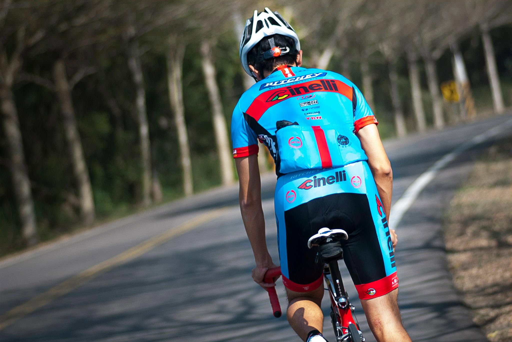

今天要提到的是一個很老很老的朋友，一個從高中認識到現在的朋友，真的是孽緣。在寫之前我覺得這種認識很久的一定很好寫，結果我錯了。我們之間發生太多事情了，好事破事都一堆，重點我們不是高中畢業後斷斷續續的聯繫，是畢業到現在一直都很密切聯繫的朋友，這種反而真的不知道怎麼寫。

講實在的，我連高中怎麼認識他我都忘記了。回憶起來的時候，感覺一下子就快進到文化中心後門抽菸的日子，或是他騎小紅載我上學，或是買肉羹麵，在那邊比誰敢加更多的天下第一辣。還有陪我去暨南場勘，去採訪他爺爺，參加畢業典禮，真的每個都是一段故事，剩下的只能用很多名詞帶過去：粉粉團、攝影、向上水餃、撞球場、打擊場、玩煙斗、GTA等等等等等。我手機甚至還有他某一年錄影的新年新希望，那天他惹毛我了我再放到網路上公開。

我實在不知道講什麼，所以我決定講一個，以 2026 年的我來看，最想感謝他的事情，就是一些會覺得有你真好的回憶。

我們在高中的時候，那時候智慧手機八字還沒有一撇，我們的手機都還是黑白的，彩色手機那時候才剛問世，手機音樂還是 midi，大家還會自己在手機裡編鈴聲，天空之城是很多人的最愛。這扯遠了，在這種情況下，攝影其實是一個有門檻的消費，當時甚至還有「得數位相機的人得女朋友」的說法（我自己胡扯的）。

我運氣很好，馬修就是一個有相機的人，當然另一個好朋友咪咪也有，不過他是另一個故事了。當時我們還有一些殘留的照片，幾乎都是他負責操刀的。真的是沒有他，我高中會少了很多回憶。雖然說大部分的照片，看了其實也不知道當時在想什麼，但是有人幫忙紀錄，感覺還是挺不錯的。

而且他有一個很莫名的堅持，一定要帶相機出門。然後很多活動我們都會一起搞，所以他身兼了我的御用攝影師。我記得一次，某次我要跟我大學同學一起去合歡山跨年，他說他也要去，於是他就從台中騎車來埔里找我，再一起殺上去合歡山。台中到埔里可是有足足 60 公里啊。然後合歡山海拔還有 3000 啊，然後就直接在山上熬到天亮再下山。年輕的時候真的很瘋，然後他當然也是背著他的相機過來的。現在就算給我錢也不幹這種事情了，用想的就累死了。

我之前在車店上班的時候，有一天，他突然興致很高的說要幫我拍照，我就想，不錯啊。所以我們就決定去 139 拍照，那是一段很美的山路。對，那是一段山路，然後當然是我騎公路車，他騎機車。我想大家應該都聽過布列松那句很有名的話：「決定性的瞬間」，然後攝影師都很有追求，如果沒拍好，沒抓到那個瞬間，他就要重來。為了達到他的要求，那天我就在那個山路來來回回沖了幾十次。每次衝完我都以為可以收工了，然後其實他根本不在意我騎的怎麼樣，每次我回頭他都在低頭看螢幕，然後搖搖頭：「不行，再一次。」

「幹！」

最後的成品我覺得很美，但我人也快死了。

怎麼說，每個人都會有自己的青春，但不是每個人都有把青春紀錄下來。我其實不愛拍照，但我身邊剛好有一個總是背著相機的人。而且他也不太在意我愛不愛拍，反正他想拍就拍了。

我覺得朋友也不一定是什麼很偉大的東西，不一定要互相扶持，或是拯救於水火之中之類的，那可能電影才會有。我們就只是一起經歷了一些事而已：某一年一起去了什麼地方、某一天聊天聊到天亮、一起討論未來的人生之類的。每一件事都不怎麼樣，但累積起來就覺得，好像還不錯？

最後附上高清的肥宅背影照，也感謝馬修紀錄了我的青春。

