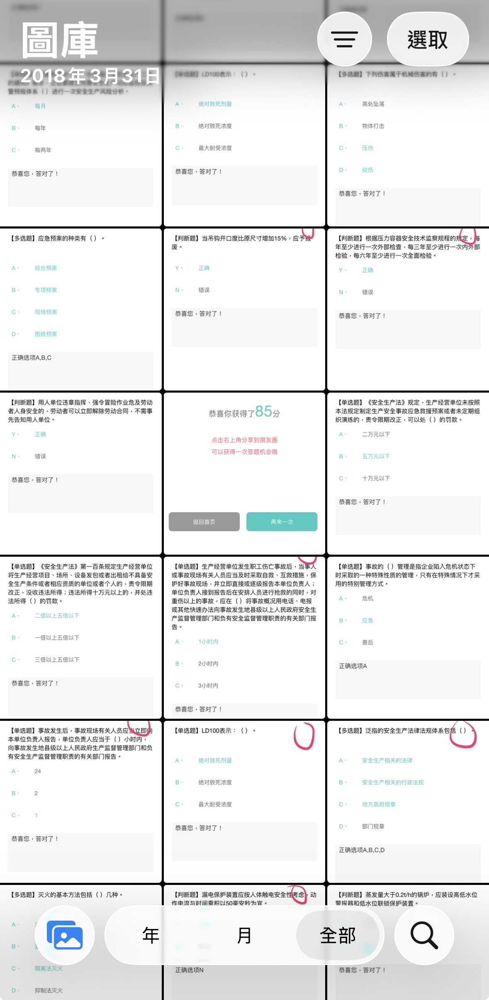

她是我在深圳工作時的老闆。對我來說，她有兩個很重要的意義：一個是改變我人生方向的貴人，另一個就是替我取了 DBB 這個名字的人。除此之外，她做事與看事情的方法，也在那段時間影響了我。

我在深圳工作了四年多，那段時間受到她很多照顧。可以寫的事情實在太多，不可能全部寫進一篇文章裡，所以只能先挑幾個我印象最深的片段。

---

首先要提的一定是 DBB 的起源。

應該沒有幾個人知道 DBB 的起源吧。說到 DBB 的起源，其實也蠻單純的。當時我需要一起修改機台的核心程式碼，然後我們就需要區分某些段落是誰做的，所以就需要在自己寫的程式碼後面加上註解。我記得我每次註解名字好像都太不一樣，於是她就幫我取了一個新的代號：DBB。

原因也很簡單：杜白白的拼音開頭等於 DBB。

至於我有多喜歡這個代號，應該就不用說了，這個代號我就一直用到現在，甚至買 domain 都是直接買 dbb.tw。這名字又短又有辨識度，我真的太喜歡了。

另一個影響更大的，就是寫程式了。

在去深圳之前，我是一個純純的歷史系學生。大學雖然修過 C 語言，但是作業是叫我妹幫我寫的，上課是睡過去的，所以我跟這東西一點都不熟。

當時剛到深圳工作沒多久，公司就決定要開發一個內部的 ERP 系統，然後就把這個機會交給了完全沒有基礎的我。

當時給了我一個 W3Schools 的網站，又請黃先生花了一個多小時跟我講解了 XAMPP，接著就決定開工了。老實說細節已經忘光了，我只記得我老老實實的從第一個頁面看到最後一個頁面，全部吞下去。

真的不知道自己學了什麼。

要說我那時候有多差，有一個例子可以說明：

在學了一兩個月後，突然有一個機會，可以向一個高手 Wen 請教各種程式問題的時候，我還記得我問他的第一個程式語言問題：「為什麼 PHP 會有四種迴圈寫法，我只會一種怎麼辦？」

這就是我當時的程度。

不過學程式的過程，在這邊不是重點，只是從現在的角度看，她似乎比我自己更早發現：我能走上不同的路。

也的確，到現在十幾年了，我還是一個軟體工程師，如果沒有她給我這個機會的話，我大概也不會走上這條路。

---

除了替我取了 DBB，也讓我走上寫程式這條路，她還影響了我做事情和看事情的方法。

還記得當時我們經常一起上下班，也因此有很多聊天的機會。

有一次開車的時候，她問我最近在幹嘛之類的問題，我就說最近很喜歡哲學的書。她想了一下就問我：

「這個可以賺錢嗎？」

我已經記不清楚當時完整的對話了，她說的也可能不是字面上的這句話，我只記得大概的內容，如果記錯了請多多包含。

我只記得當時我其實不太認同這個問題。我覺得人生不應該只考慮賺錢，如果喜歡一件事情，一定要帶來什麼實際利益嗎？

但這個問題非常的實際，理想與興趣也需要現實條件的支撐。一個人可以追求自己喜歡的事物，但也要有能力照顧自己、承擔自己的生活。

直到現在，我還是常常會想到這個問題，也會拿來跟朋友討論：生活與個人追求之間的平衡要怎麼做比較好。我到現在也不知道答案，但肯定的是，必須要先對自己的人生負責，才有餘裕去追求一些詩與遠方。

另一個就是面對問題的方式。

她以前很常說，遇到問題就撞下去。撞一撞，答案自然會出來。

實際的原話我也記不清楚了，大概就是這個意思。

這說法聽著很簡單，但這不是那種努力就好的熱血。撞完之後如果沒有端出什麼成果，只有跟她說我很努力了，她也是不吃這一套的。那幾年裡，我真的撞了不少牆。寫程式就一堆了，還有與同事的溝通、帶人、跑客戶等等，很多時候根本不知道怎麼下手，也根本不知道到底我能不能解決這些事。

不過我的運氣也很好，每次真的卡住時，剛好都會遇到願意幫助我的人。那幾年雖然碰了不少壁，最後倒也沒有什麼事情真的做不下去。很多東西，就是這樣一邊犯錯、一邊求救，慢慢摸索出來的。

除了遇到問題不能躲，她對「標準」也有一套很直接的要求。

我在深圳期間遇過兩次需要考試的場合。一次是考駕照，另一次是考安全負責人的資格。

考試本身我並不特別擔心，反正把書念完，應該就能通過。但她的要求不是通過而已。

她說：

「你要考全公司最高分。」

我當時的反應大概是：

「......？」

考駕照的時候，她要求我至少考到 95 分，好像全公司最高的就是 95 分吧。

我記得當時準備駕照的時候，週末她還叫我到公司一起刷題。大陸駕照筆試是真的難，題目超多，然後又很多不懂的場景，什麼雪地標示什麼的，我根本沒概念。要及格肯定沒問題，但只能錯兩題就有點難受了（我記得一題好像2.5分），最怕的就是不小心過了，然後分數沒到，連補考的機會都沒有。

考安全負責人的時候，因為生產經理也會一起參加，她也要求我的分數要比生產經理高。

問題是，我們的生產經理本來就是很會讀書的人。為了贏過他，我只好每天讀書讀到超晚的，打算用勤勞擊敗天賦。

但最好笑的是，生產經理看到我下班後還留下來念書，他也開始跟著留下來念，我不知道為什麼變成這樣。我看著他愈來愈認真，心裡真的很想跟他說：

「唐經理，放過我吧。」

我到現在手機都還有當時做練習錯題的螢幕截圖，到現在捨不得刪掉，我那段時間真的壓力超大的。

當然我最後分數真的比他高。

不過不是我真的比他厲害，考完後我們才知道，安全負責人的題目通常會比較簡單，生產經理那邊的題目會比較難，不過不管公不公平，至少我贏了，好險沒有漏氣。

還有一件事，我到現在也一直記得。

因為私底下相處時間多，我難免會抱怨同事。她不只一次提醒我：「刮別人的鬍子之前，先看自己的鬍子有沒有刮乾淨。」

而且這個標準，她自己也有做到。

如果上班遇到塞車，哪怕只是晚到幾分鐘，她也會先在群組裡說一聲。這看起來只是一件小事，但是從這些小地方就可以看出來，她對要求別人之前，對自己的要求也是沒有在打折的。

這句話後來也成了我經常用來提醒自己的標準。

我還是會對別人沒做好的事情提出意見，但是在講之前，我都會想，同樣的標準，我有沒有做到？

我當然知道不需要等到自己完美才有資格評論，但如果自己都沒做到的事，用很高的標準去要求別人，那麼這些話可能分量會有點不足。不是不要批評，而是批評別人以前，先把同一個標準放到自己身上試試看。

---

四年多的時間，能講的事情實在太多了。

真正開始整理以後，才發現很多平常好像已經忘記了，但只要想起一個片段，相關的記憶又會一件一件的浮出來。

要把它們全部濃縮進一篇文章裡，確實是不可能的。

自從離開深圳以後，我們不再像以前那樣天天見面。到了過年、端午或其他節日，偶爾還是會互相傳一句新年快樂、端午快樂。訊息通常很短，就一兩句話或一個貼圖，但每次收到，心裡還是挺高興的。

十幾年過去了，我到現在還是個軟體工程師，也還在用著 DBB 這個代號。

寫完之後再回想一下，她當時教會我的東西，很多到現在都還在影響我。無論是做事的方法，還是遇到困難的態度，很多都是在那幾年打下基礎的。

所以深圳那幾年，對我來說真的不只是一段工作經歷而已。

雖然她應該是看不到這篇文章，但還是要說：非常感謝這段時間的照顧！

---

最後附上手機當初刷題的截圖，這真的是太有趣的回憶了，不過有機會的話，我也不想再考一遍了。

