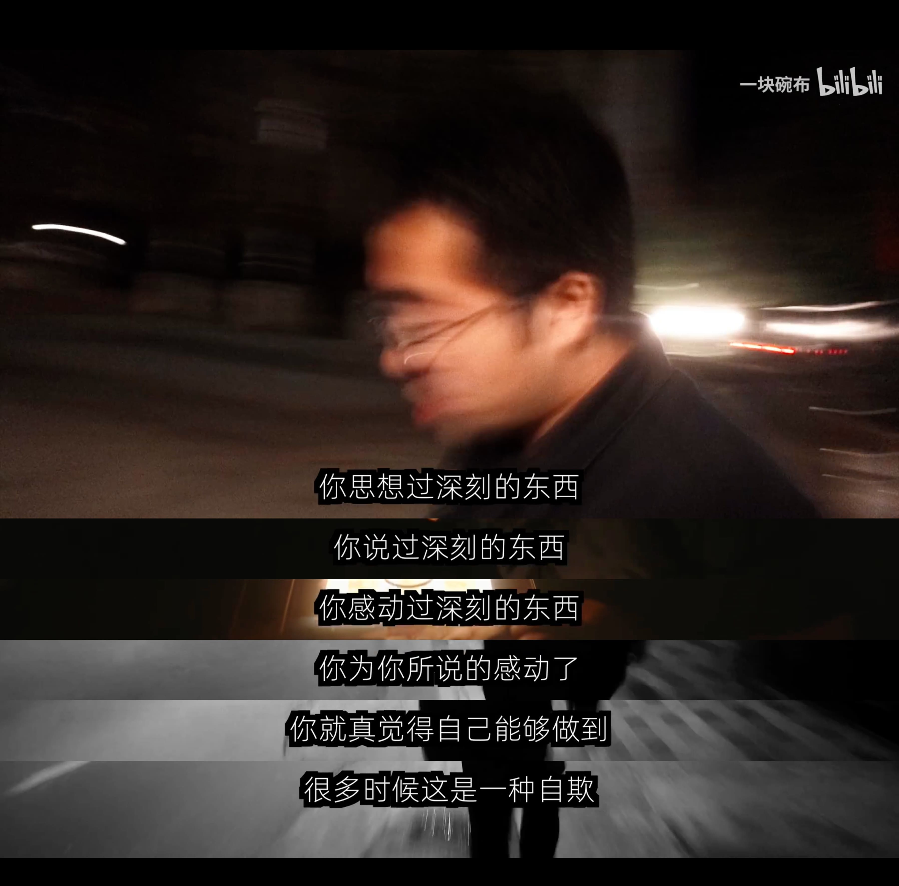

最近比較閒，看了一些書和文章，有關於改變自己的，也有關於仇恨如何延續的。

每次看完後，我都會有一種錯覺：我好像已經不是過去的那個我了，好像又更接近某個理想中的自己。因為看了這些比較深刻的東西，然後被某些故事或是句子感動後，就以為自己成為了這樣的人。但實際上，睡一覺醒來，日子還是一樣在過，昨天的感動，往往只是一個漂亮的情緒波動而已。

關於這件事，我最印象深刻的回憶，是大學時期與教育心理學教授的一段對話。教授那時候要我們繳交一份作業，題目我已經忘記了，但是我記得我寫的是某位同學被霸凌的事情。我寫的很具體，也很激動，彷彿這個人是我最親近的朋友，而我也彷彿真的站在正義那一邊。教授看完後，只問我一個問題：

「在你看見這件事、產生憤怒之後，你具體為這位同學做了什麼？」

我答不出來。

因為我其實什麼都沒做。我只是坐在教室的一角，看著事情發生，然後擅自憤怒。我的憤怒很真實，但沒有變成任何行動，最後就只是一種自我感動而已。我已經忘記當時怎麼回覆了，可能是那種小屁孩式的狡辯：這是體制的問題、這已經超出我能力範圍了等等。這些其實也沒什麼錯，但這些理由並沒有改變一個事實，就是我沒有為這個同學做任何事情。大學很多回憶都已經忘的差不多了，但這件事一直還留在我心裡。偶爾就會從某個角落跑出來，質疑我：「當時的憤怒，究竟是為了同學，還是為了讓自己看起來像個好人？」

類似的事情其實很常見。看了一本書、一部電影，或是聽到某段話後，突然被打動，開始想起自己的人生，覺得應該要改變一下了。也許是換工作，也許是離開一段糟糕的關係，也許是重新整理自己的生活。這種衝動通常都很強烈也很真實，但通常就只有這樣，忙了一兩天之後，什麼改變也沒有發生。

幾年前坂本龍一過世時，很多人重新分享《遮蔽的天空》裡那段話：

「因為我們不知道死亡何時降臨，我們才會以為生命是個永不乾涸的井。……你還會看到多少次滿月升起？也許二十次。然而我們卻總覺得這些都是無窮的。」

這段話真的很美，在提醒我們生命的有限性，不要把重要的事情延後。但是如果僅止於感動，沒有真的重新安排時間，或是去做一件一直推遲沒做的事，那麼最後就只剩下社群媒體上的一個電子碎片而已，然後偶爾會跳出來提醒一下，永遠在感動，永遠不會做。

我們聽歌會陶醉，看電影會感動，包含看書、欣賞藝術等等，這些都會讓我們產生很強烈的感受，我認為深刻的體驗本身沒有問題，但是把「被感動」誤認為「已經改變」，那就很危險了。畢竟感動只是一個開始而已，不是結果。所有的理解、情緒都很真實，但這件事並沒有完成任何事情。就像那些知識型影片底下常常會有人留言：「收藏從未停止，行動從未開始」。

所以真正的困難不是被感動，因為某種程度來說，感動其實很簡單。
真正困難的是，在情緒退去之後，還願意做些什麼事。

看完一篇文章，想起了某個失聯的老友，那麼就去傳一則訊息。  
聽完一個演講，想起一直逃避的某件事，那就去做第一步。  
如果看見不公不義的事情，至少要捫心自問：「現在能做些什麼？」  

不一定每次被打動，都要馬上做出改變命運的壯舉。但至少要做出一個動作，把感動轉化成現實。否則再深刻的感動，也很可能只是另一種自我陶醉而已。

最後附上我很喜歡《電工小謝》裡的一段對白：

你思考過深刻的東西，  
你說過深刻的東西，  
你感動過深刻的東西，  
你為你所說的感動了，  
你就真覺得自己能夠做到。  
很多時候，這是一種自欺。

