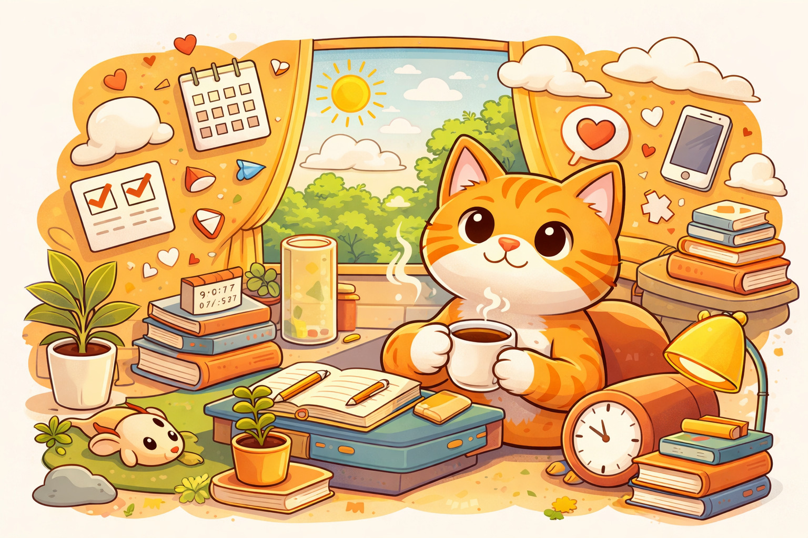

## 前言

我們都知道人生最後都會走向終點，但其實都只是概念上的理解，並沒有真正意識到時間的有限性，也沒有把「好好活著」當作一回事。往往要到某一個轉折，才驚覺人生沒有想像中的長。在這個前提下，這本書就是在告訴我們如何正視這個問題，並且好好生活。

## 注意力就是生活

書中有幾個我很喜歡的觀點，首先是：注意力就是生活：你活著的體驗，就是你付出注意力的每一件事的總和。現在很流行注意力經濟，每一個大公司、每一個個人創作者、甚至家人朋友，大家都在爭奪我們的注意力，畢竟一個人同一時間只能做一件事。社群媒體的演算法，只在乎你喜不喜歡這個內容，而不是最有用最真實的內容。例如我們總是可以輕易的看到同溫層的新聞之類的。這會讓我們的注意力被不斷引導，長期下來，會被塑造成某種偏狹的版本，而不一定是我們真正想要的。

## 休閒變成另一種待辦事項

現代太追求意義了，連休閒時間都變成追求放鬆這件事。作者鼓勵我們以某種「浪費的方式」來體驗樂趣，反而可能是更不會浪費休閒時間的方法，而非暗自希望，這件事在未來的某一天會幫助到我們。換句話說，能不能接受時間「只是存在」，不產生任何價值。這個其實很反直覺，尤其是現在下班鼓勵要多做一些「有意義」的休閒娛樂，應該要看有意義的書，上一些對人生有幫助的課程。我們很難接受有人下班無所事事做一些很奇怪的娛樂。例如跑步的意義不在於未來跑出成績，有時候只是想跑步這件事可能就足夠了，在不可能出類拔萃的事情上面，就不需要焦慮的善用時間，好好享受跑步帶來的快樂就夠了。

## 關鍵不在於排出事情的重要性 而是如何處理遠超我們能處理的事情

現在的社會需要做的事情實在太多了，然後很多生產力大師告訴我們如果善用自己的時間，就可以把所有事都搞定。我以前也是生產力的信徒，我在電腦裝了一堆生產力工具，蕃茄鐘計時器、使用時間追蹤與防分心應用等等。效率真的提高，也做了更多的事，然後發現我一點都不快樂。事情永遠都做不完，我等不到清淨下來的那一天。我應該要意識到，每一秒鐘我做的決定，就是注定要放棄其他千千萬萬種的可能性，而這個放棄是一個找回自己人生很重要的一個關鍵。

## 結論

書中給出了十幾個論點，很難全部都列舉出來。我覺得書中提出的觀點都蠻不錯的，也有給出具體的實作方法。在這個越來越快，越來越卷的時代，給了我們另一個思考的角度。尤其是近幾年AI工具出現後，好像並沒有得到更多的快樂，反而焦慮變得更多了。工程師被迫產出更多的程式碼，文字工作者需要產生更多的文章，工具越來越進步，然後我們卻越來越忙，不學習新的技術好像就要被淘汰了一樣。我們永遠不可能完成所有想做的事情，直視有限的時間，然後面對每一個選擇必然會放棄更多選擇，基於這樣的思考，我想這樣應該可以讓人生過的更有意義一點。