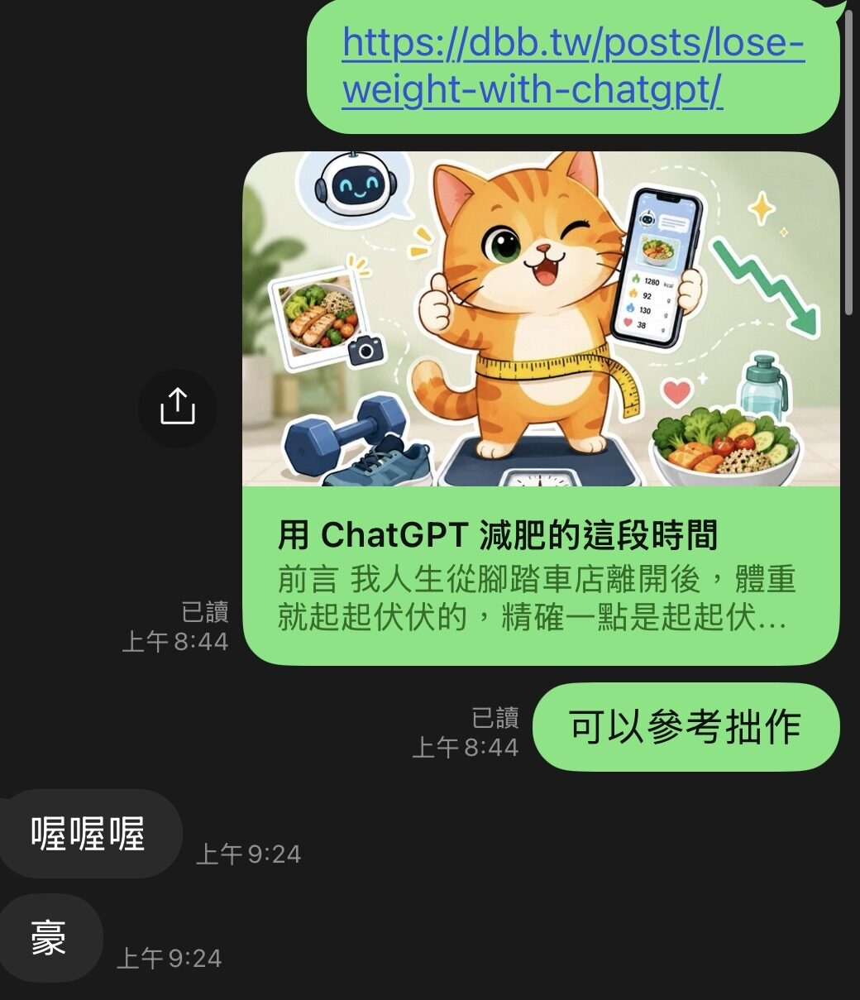

最近公司專案的進度告一段落了，所以今天是以一個比較輕鬆的心情下班。最近天氣蠻好的，所以都是騎機車上下班，路途就是聽著音樂發呆，然後想事情。今天可能是比較放鬆吧，突然想到2026也堂堂進入下半年了，回憶起來，今年上半年的變動真的很多。我休息了好久，跑了很多步，換了新工作，寫了一些文章，看了一些書，聽很多音樂，很有趣的是，當初面試我的人也離職了。整個上半年的心得，就是什麼東西都在不斷的變化吧。在這種不穩定的時候，特別會想要找點事來做，分散一點注意力。就好像明天要考試了，我反而會把家裡整個打掃一遍這種感覺。

其實我也不知道接下來我人會在那邊，畢竟人生的變化難以預測，尤其是今年。照理講在這種動盪的時候，應該要試著多刷題，看一些系統架構，多讀一點英文之類的，為自己的人生多做一些準備。就是感覺應該要做些什麼正經事，但是又真的沒什麼興趣，然後我又是那種沒興趣就真的沒幹勁的人，所以就在想有什麼我比較喜歡的挑戰可以來做。

在台灣，工程師最常見的大概就是30天的鐵人挑戰賽吧，但是要我連續寫30天技術文章，我可能真的會瘋掉，連續輸出一個主題30天，其實要有相當的儲備還有深度，而且很容易可以想到的是會有時間、進度壓力。而且當工作強度上來的時候，我真的有辦法維持嗎，可能會做不到。這想起以前還在寫網誌的時候，也挑戰過連續寫30天網誌，然後當時我失敗了。在沒有限定主題而且時間相對多的情況下都堅持不下來，我不覺得現在的我有比那時候強大多少。

就在苦惱的時候，刷 reddit 的時候突然看到一篇文章「Let's form a daily habit: 30 days writing challenge」其實內容很普通，最後一句是寫：

Going to write now, see you tomorrow.

這其實沒什麼特別的，但是就是這麼普通的話，就突然打動我了，我就想，那就來寫吧。

原本主題已經收斂成4種了：動漫、書、音樂、電玩，因為這幾個是我人生少數沒有真的中斷過的東西。隨便找個30個作品來寫，感覺不會很難，而且光是可以一邊寫一邊分享那些我心目中的神作，想想就很有趣。

正當我要開始決定的時候，手機突然收到通知，Facebook 有人標記我。我想說什麼鬼，可能是某個低能兒又在某個遊戲下面亂標記我吧。結果打開出乎意料，是一篇感謝文，感謝我分享 GPT 減肥法給他，然後他也成功了。雖然他只有提到我一句，但是我還是非常開心，畢竟朋友成功了，當然要一起開心，而且這份榮光，他必須分我一份。

但看完那篇之後，我整個人坐不住了。

本來昨天跑得很累，今天打算休息，結果我還是換上衣服去跑步。我其實就是這麼膚淺，看到朋友成功，突然就覺得自己好像還不夠累。反正都出門了，順便想想要寫什麼也不錯。然後跑著跑著，我覺得漫畫心得感覺很不錯，複習速度快，然後我的閱讀量應該算蠻高的，就在我開始構思我的漫畫藍圖的時候，意外發生了。

一個以前的朋友突然密我，說他搞砸了公司的一些事情。這麼大條的情況，我只好一遍跑步，一邊艱辛的回訊息，發生什麼事情已經不重要了，最後我們聊到一個很簡單的結論：「如果我走歪了，有人語重心長的跟我說，我會感謝他。」

然後我突然想到，我不一定要寫作品。畢竟改變我人生最多的，就是我身邊這些稀奇古怪的人。雖然他們的人生就算出了傳記可能也沒人買，不過至少我會買上一本，畢竟我覺得我的朋友們都蠻酷的。於是我決定，就來寫這些朋友們吧。

不過這挑戰有一個大問題，就是我其實沒有認真數過，我到底有沒有30個朋友可以寫，會不會寫到一半發現其實我沒有朋友，不過我也不想現在打開一個表格開始回憶。所以我決定主題改成那些我周圍值得尊敬/有趣的人，這樣範圍會稍微廣一點，當然有一些比較敏感的人就不會寫進來了，畢竟我的人生還是要過呢。

就是這樣，雖然寫著寫著時間已經變成7月4號了，不過我還是把這篇歸類在3號。睡起來就要開始構思我的第一個人啦。這其實不是什麼偉大的計畫，也不是要證明我多自律。只是突然覺得每天記下一個我見過的人，這件事可能比我想像中的有趣，無論最後有沒有30個人可以寫。

結尾還是要提一下，當時我朋友問我減肥的事情，我其實也懶得回答他，隨便丟個網址給他，我們後續就沒有針對這個話題討論了。然後他就默默持續到現在，典型的人狠話不多。

我真的覺得，在行動前面，很多語言都顯得蒼白無力，動起來吧。

最後附上我贏得的感謝文：

---

巨型肥宅到普通肥宅的年度紀錄📒

從疫情那年去拉斯維加斯參加大麻展回台，體重飆到驚人的 104 公斤。當時只覺得是美國食物太罪惡，應該只是暫時的巔峰，後來降到 102 公斤就一直擺爛，直到去年初。

關鍵轉折是事務所拍形象照，驚覺自己怎麼擺姿勢都遮不了嘴邊肉，甚至修圖後還是滿滿的肥宅樣。之後出國旅遊、朋友聚餐，開始覺得怎麼拍都很肥；坐下時，肚子明顯卡在那裡，比RTX 5090還卡，甚至開始抗拒、害怕被拍照。

幸好聽到工程師好友白白 杜白白 靠 ChatGPT 大爆減肥、簡直換了一個人，便向他請教如何用 AI 減肥，抱著一絲希望開始照表操課。

我的 AI 減肥法

我先將日常作息、目標與能接受的方式提供給 AI。例如：我可以接受 168 斷食、沒廚房只能當外食族、想用極低運動量達成目標等。

AI 給我的核心方針大致如下：

蛋白質吃足： 體重kg X 1.2~1.6g

水喝足夠： 體重kg X 30ml

營養補充： 膳食纖維要補足、睡眠品質要顧好

巨大改變飲食習慣是有學習曲線的。剛開始我幾乎每餐、每種單品都問 AI 能不能吃？怎麼吃？身為外食族，問久了自然就能盲測出食物的營養素。

舉個最簡單的例子，看到路邊烤香腸很想吃，就問 AI 吃了會怎樣？

它通常會說：「盡量不要。如果一定要吃也無妨，但分一半就好，而且因為鈉含量高會導致身體水分滯留，你明天看體重計可能會難過。」

媽的，AI 都這樣講了，我只能忍住，或是餓到受不了改買茶葉蛋吃。

突破停滯期

前半段體重掉很快，2025 年 7 到 12 月就掉了快 10 公斤，來到 93 公斤左右。此時迎來了平台期，開始有卡關的感覺。

我問 AI 該怎麼辦，它問：「既然不想運動，要不要試試多走路？一天多走三千步就好唷～」

我被它說服了，開始增加每天的步數、出門故意繞遠路。結果體脂確實又開始下降，體重曲線也穩定往下。雖然進度很慢，每天量體重看到回彈 0.1 或 0.2 公斤會有挫敗感，但拉長到兩三週看，整體趨勢其實是下降的，體重計 App 的健康分數也越來越高，我就知道方向對了。

一年來的減肥五個小秘技
1. 在能忍受的範圍內改變： 幅度太大的劇烈改變絕對無法持久。
2. 天天量體重： 藉此重新認識自己的身體組成。
3. 善用氣泡水： 是個好東西，能促進腸胃蠕動又有飽足感。
4. 控鈉防外腫： 鈉含量決定水腫程度，能不沾醬就不沾、能不喝湯就不喝。
5. 原型食物至上： 水煮蛋、茶葉蛋絕對是減肥最好的朋友。

階段性總結

階段性目標達成了！一年時間少了快 16 公斤，體脂也降了 5% 多。希望今年下半年能順利減到大學畢業時的樣子。

這是我的年度報告，大家如果想要蕉流蕉流也歡迎哦！

