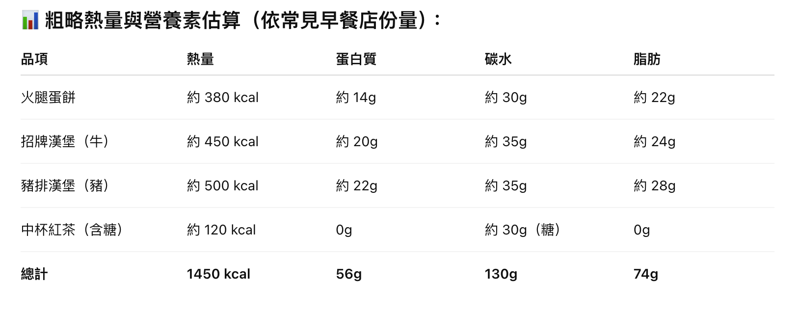

## 前言

我人生從腳踏車店離開後，體重就起起伏伏的，精確一點是起起伏伏起起起起...。

整個人雖然不算胖，但也與「瘦」沾不上邊。

這幾年來試過自己煮飯、多騎車、多跑步、跳跳繩、徒手運動...。短時間內都可以獲得一些成效，但只要工作一忙錄就會不小心吃爆或是不運動，然後又胖了。

不過因為人一直都不算很胖，所以動力就不是很強烈，好像也沒有收到什麼負面評價。

新朋友不知道我曾是瘦子，舊朋友也習慣我變胖，大概是這樣。

## 想認真的契機

過去一年，在同事的邀約下，我除了跑步、打網球以外也增加了踢拳，然後我也有意識的吃健康一點，情況似乎要往好的方向前進了。如果在漫畫裡，大概一話之後我就要變身成一個精壯的運動人了。

然後在去年9月的時候跟一群大學的老朋友去聚餐，沒收到讚美就算了，他們對於我做那麼多運動以及飲食感到很詫異，問題都是一樣

***「為什麼你這麼努力卻完全看不出來」***

他們的反應讓我感覺自己像個徒勞無功的胖子，就跟買書不看的人是一樣的，以為有買書就會變聰明一樣。

我當時還安慰自己，可能是他們看不出端倪，或是成效還沒展現出來而已。直到某一天，心血來潮站上體重計，我想要證明我是對的，結果事實證明，我竟然比運動前還胖了5公斤。 當時的數據如下：

體脂 25% 體重 81 內臟脂肪 11 

***體重計不會說謊***。

這是我蠻常拿來嗆胖子的話，現在變成一個迴力鏢狠狠的尻到自己的臉。

但其實我自己也不知道怎麼辦，就照樣吃我以為健康的食物，然後就持續一直到今年。

## 遇到師父

有一次在公司遇到一個老同事，原本身形較為豐腴，如今整個人明顯瘦了一圈，變得十分輕盈。

我好奇到不行，問她是怎麼做到的，她也沒有藏私，簡單來說就是把基本資料丟給 ChatGPT 然後三餐拍照給 GPT 幫忙計算熱量。

就這樣？

我當下聽到的時候，其實大概就聽進去不到一半，我覺得應該沒這麼簡單，感覺她應該是使用了什麼極端的意志力之類的才瘦下來。不過基於好奇心，我當天中午吃午餐的時候就順便拍一張照片給 ChatGPT 讓他看看。

不看不知道，一看嚇一跳，我以為我吃的很含蓄，結果遠超過我的預期，當時的對話紀錄如下圖：



基礎代謝當時大約一天是 1800 一餐就炸掉，難怪越吃越胖。

看完後我就決定要認真面對這個現實，認真的跟隨師父（我心裡這樣稱呼，她也不知道）的腳步前進，加入 ChatGPT 減肥班。

## 使用 ChatGPT 減肥

接下來我每天三餐都拍照給 ChatGPT，讓他協助我記錄熱量與營養素，就像一位隨身營養師，每日攝取達到基礎代謝率（BMR），並確保足夠蛋白質的攝取，基本原則大概是這樣。

然後我從 3 月底到現在 7 月初，成效是：

- 體重：81 → 71 公斤
- 體脂：25% → 21%
- 內臟脂肪：11 → 7

大概三個月瘦了10公斤，遠比想像中的快且有效率，第一次可以減少這麼多體重，真的是非常開心。

目前看起來沒有什麼反彈的可能，這三個月中間，難免會有聚餐，慶生等等大吃大喝的東西，但其實都可以在控制內，一兩天吃超過也不會有什麼影響，也逐漸培養出對食物基本的敏感度。

知道什麼該吃什麼不該吃，我以為的低熱量其實不低，也會關注除了熱量以外蛋白質是否足夠？脂肪是否過高？。

最簡單的例子，過去我運動後我都會犒賞自己大吃一頓，例如打球消耗快一千大卡，我就獎勵自己吃一頓麥當勞，我心裡預期大概剛好打平，結果實際上我麥當勞一餐就吃快2000大卡（笑）。

## 實作上的細節

我們有一些同事也跟著加入 ChatGPT 減肥班的行列，也都有發展出自己的一套流程，每個人都不太一樣，我這邊分享我的操作方式

### 添加日期

輸入食物的時候，記得要添加日期，否則他會不小心把前幾天的運動或是飲食都加進去，叫他刪掉其實也蠻麻煩的。 例如 7/24 午餐 牛肉麵 附上照片這樣。如果每天都是 早餐：XXX 午餐:XXX 你叫他總結今天的熱量，可能會幫你把前幾天的都算進來，就會變得很麻煩。

### 注意討好的性格

ChatGPT 有時候會過度討好，即便是你請他用嚴厲的角度判斷，你硬要凹他也不會太堅持。

例如某一天我超級想吃雞排，我就說我今天真的超想吃雞排怎麼辦，他反對一下之後就說放心吃吧，一天的爆炸不是爆炸，甚至會鼓勵多一些欺騙餐。或是問得太積極，它可能也會回應過於激進的策略，可能會突然推薦激烈的斷食七天，這其實都蠻危險的。自己還是需要一些判斷，或是要他把相關的文獻交出來自己看一下有沒有問題。

**他終究只是一個輔助工具，重要決策仍須自行查證或諮詢專業人士。**

### 速度過慢

由於每次對話都會夾帶上下文，導致回應變慢。所以我習慣一週就開一個新的對話來記錄，不然真的很慢。我是有付費，所以直接開一個減肥專案，我同事沒有付費的，基本上也是每週把 prompt 貼在開頭之後繼續紀錄，也能得到一樣的效果。

### 運動紀錄

考量穿戴裝置的誤差，我習慣把手錶上的熱量打七折後攝入。不過如果沒有運動手錶也沒差，上網查一下運動消耗基本上都差不多，例如跑步半小時 200 大卡之類的。

## 結論

其實用 ChatGPT 減肥非常簡單且容易執行，就類似坊間健身教練或營養師幫你看三餐有沒有吃對這樣。而且中間隨時可以與他對話調整策略，例如我中間發現我運動表現變差，他就幫我分析：碳水吃太少，會影響運動表現，減少脂肪攝取，增加碳水攝取。或是我體重下降了，
但內臟脂肪卻一直不動如山，他就幫我分析：我熱量雖然達標，但脂肪每天都攝取超標。基本上就是邊實踐邊優化，不太需要煩惱太多。

基本上免費，雖然準確度有限，但最大的好處就是對於我們來說非常方便，可以馬上回應並告知結論。加上我們的食物基本上都有營養標示，所以很多時候拍營養標示就夠了。

其實也有一些 app 用 LLM 幫忙看食物熱量，不過我覺得免費的 ChatGPT 就夠用了，重點還是需要自己實踐。

找零食宵夜基本上全部拍一拍交給 ChatGPT 判斷就好。

當然最重要的是，有沒有那個行動力，以及要有自己的判斷，如果照他的做法一段時間無效，那就需要再調整。畢竟他下面就寫著：

***ChatGPT 可能會發生錯誤。請查核重要資訊。***

最後在這邊還是必須感謝同事師父，解決了10幾年來的減肥痛點，也感謝 AI 這個方便又實用的工具。

## 我使用的提示語（Prompt）
```
我正在減脂
身高 xxx
體重 xx
性別 xx
年齡 xx
體脂 xx

我再來會給你我三餐的照片 當天有運動的話我會再跟你說我做了什麼運動
用專業營養師的角度幫我看食物 熱量 營養素 是否充足 

我如果輸入吃了什麼 給我評價外 順便把當天的結果整理給我 用文字表格的方式呈現

```