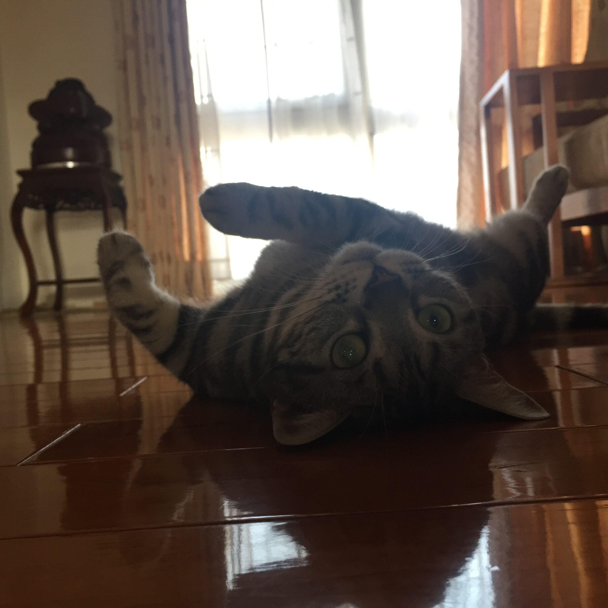

突然就出現在我們家的小貓。

她是一隻很聰明的小貓，不知道為什麼特別會開門。以前常常關著門，想好好打個電動，結果在我專注的時候，眼角餘光突然就會出現一個小小的身影，若無其事地站在旁邊看著我。

她的適應力也很好，跟著我們家搬來搬去，偶爾帶她去外面住，也總是怡然自得。好像天塌下來都跟她沒有關係，該咬的照樣咬，肚子餓了就喵喵叫。

雖然小小隻蠻可愛的，但脾氣也是真的差，自帶女王氣息，什麼生物來我們家都會被她胖揍一頓。蟑螂、壁虎、貓、狗，更別提有多少人被她胖揍了。

我幾乎每個朋友都有來跟她拜過碼頭，說她見證了我的整個青春也不為過。

因為她，我們早就習慣回家的時候，有一隻貓跑到門口，在地上滾來滾去。

出門的時候，她又總是趁機想溜出去，好像很想看看外面的世界。

她也有很笨的一面。小時候常常跳到太高的地方，結果自己下不來，只能在上面鬼叫，等我們把她抓下來。

脾氣也很倔。不想吃的飼料，寧願餓兩天也不吃，直到我們換了飼料，她才願意吃飯。

太多了。

突然發現，她對我們家每個人，好像都有自己的相處方式。

我回家的時候，她總是跑來跟我一起睡。睡覺時不小心壓到她，她還會咬我。

老媽打坐的時候，她一定要擠在旁邊，好像自己也在修行一樣。

老爸一出現，她就會一路喵喵叫，吵著要吃零食。

至於老妹，我們一直懷疑，就是她把芙芙寵成了這副女王脾氣。

有些陪伴真的就跟空氣一樣。不知不覺，她已經陪了我們家十六年。

大家都很愛說，她才是我們家的老大。

她幾乎看完了我整段青春。

現在她走了，突然覺得那個曾經意氣風發、什麼都不怕的自己，好像也跟著離得更遠了一點。

怎麼說呢，一把年紀了，離別的詩詞電影小說也看了那麼多，也感覺自己應該準備好了。

不過她真的離開的時候，還是很難過。

很多時候，真的會覺得自己什麼都不知道。看了很多，學了很多，到了真正要面對的時候，還是不知道該怎麼做。

也永遠不知道，什麼才是最好的選擇。

我不知道有沒有輪迴，也不知道有沒有來生。總之，她先幫我們去探路了。

很難忘記這個小小的家人。

