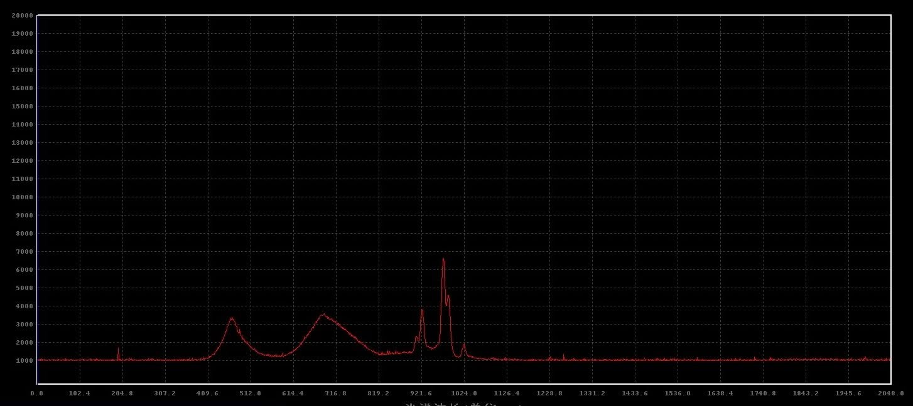
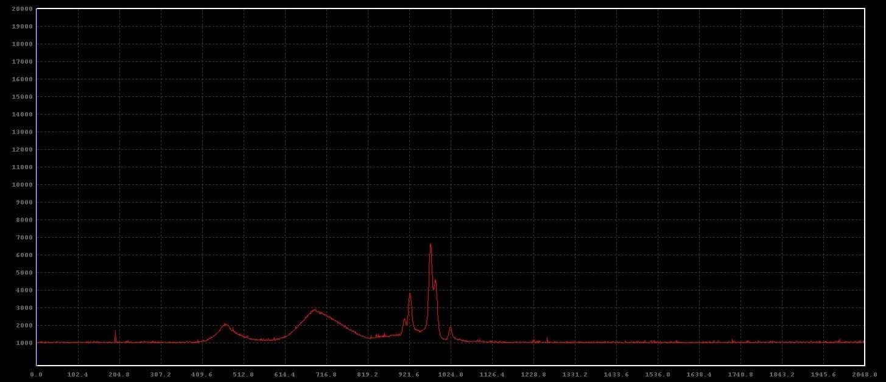
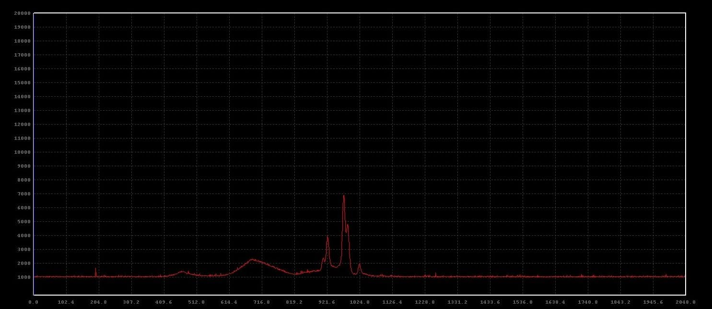
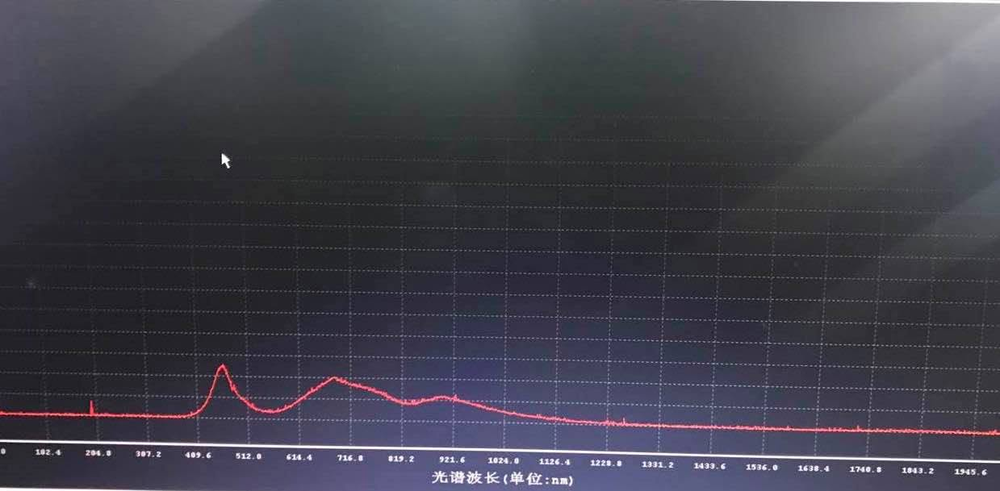

Night Shift模式

2017年9月4日

今天上班在摳定時 突然想到
聽說 Night Shift 可以降低藍光 但是效果如何我並不清楚
想到我們公司不就是在檢測 LED 的
本著有一分證據說一分話的精神
我就拿著我的 iphone7 拿去光譜儀測試一下 

測試條件如下：

用了一年的 iphone7 
亮度調到最高 
沒有保護貼
積分時間為 20000ms
 

在沒開 night shift 模式下 藍光段(420nm-480nm)收到的能量為3000多

打開 night shift 模式 色溫調整在中間 藍光段 收到的能量為2000多一咪咪

 

打開 night shift 模式 色溫調整在最暖 藍光段 收到的能量只剩下1000出頭

結論就是
看來藍光減少蠻多的XD

 

補上一張 我同事號稱貼了藍光保護膜的測試圖
手機拍照請見諒

 

藍光段大約也是3000多的能量 
結論就是他的藍光保護膜完全沒有用

 

PS
這個測試完全不嚴謹 超級隨意 參考就好 