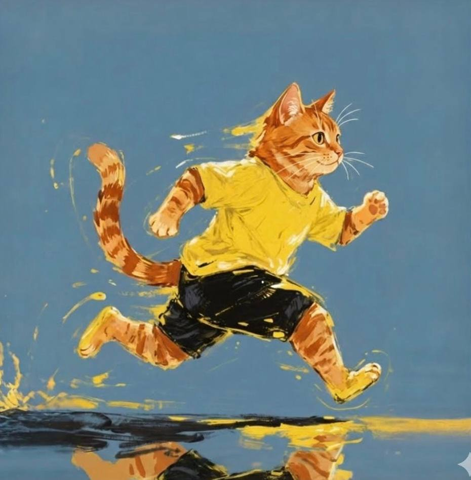
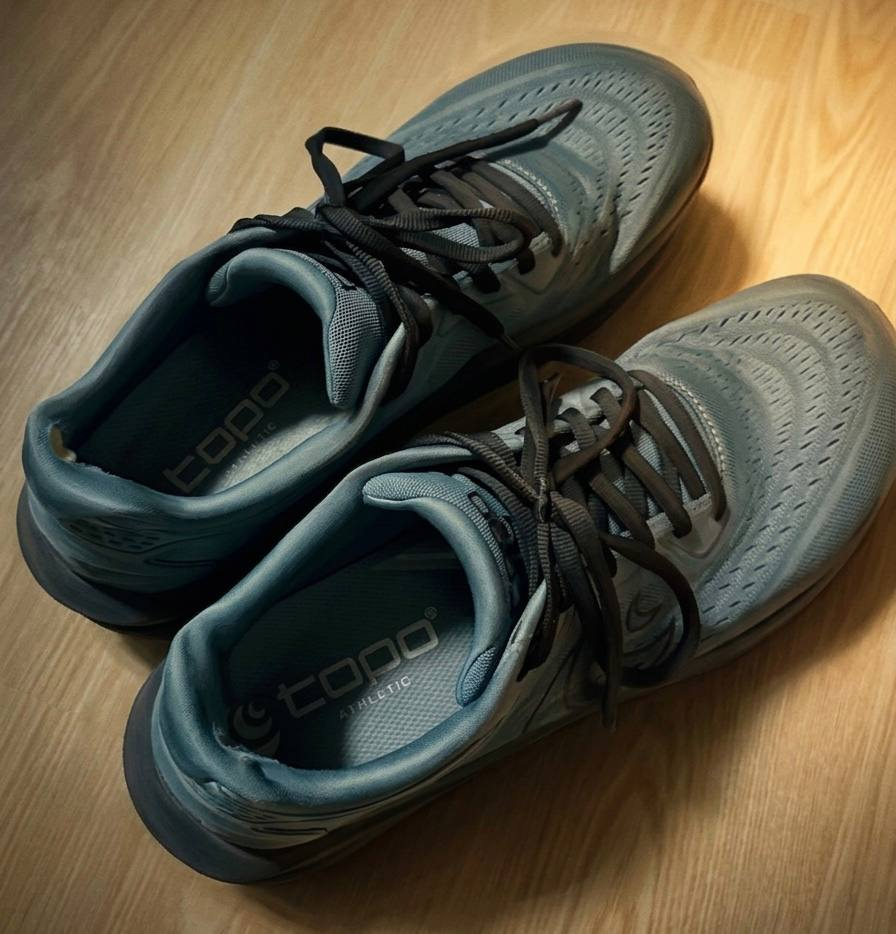

首先，想寫這篇文章是因為看到朋友在跑步的時候，他的 app 分享裡面有一隻很可愛的貓。然後我看到就覺得：好讚呀！於是我就把圖拿走了。然後回家把我家的大橘結合進去，看了看效果，覺得很棒，然後我產生讓大家看看這圖片有多可愛的衝動，就想找一個正經的理由把這張圖放在網路上。也就因為這樣，促成了這篇文章的誕生。所以基本上這篇就是一篇很水的文章，重點就在於圖片而已，不是文字。就算只看到這邊就離開，我也不會有意見。

接下來進入正題。

最早認真跑步，肯定要追溯到當兵的時候了。當兵都會要求15分鐘3000公尺，然後19歲整天抽菸完全沒有運動基礎的我，在短短幾個月內就可以做到了。當時還沒覺得有什麼了不起，因為全連的人幾乎都可以完成，一起被操，一起狗喘，一起痛苦，好像也只是當兵的一部分。現在回頭看才發現，原來那就是我人生最快的時候。每天5分速跑3公里，當時的我真的有夠棒的。

大學畢業後，我在自行車車店上班的時候，老闆要求我每天都要騎車，還會追問我當天的進度，甚至會看我的 Garmin 數據。然後每週還要踩訓練台，做一個間歇的課表。這弄的我壓力很大，因為他的課表設計都是「可以完成」的範圍，但是每次都在極限邊緣。就是這件事我一定做得到，但是很痛苦，也沒辦法說做不到。也因為這樣，我有時候就會想偷雞摸狗，改成早上跑步，輕鬆跑個10公里混過去。那時我也沒有智慧手錶，也就沒有數據給老闆看。現在想想，當時可以一小時十公里輕鬆跑，從現在的角度看，也是一個遙不可及的目標。

從車店離開後，過了很長一段時間，我跟「跑步」兩個字都沒什麼關係。在深圳的時候，我曾經有準備了一套我覺得蠻帥的冬天跑步的裝備，然後大概出去帥了幾次而已，因為真的跑不動。體能下降很快，體重上升也很快，此消彼長之下，我徹底的變成了一個肥宅。

後來回台灣後，因為真的變胖了，所以陸陸續續有試過幾次跑步，但是都是跑幾個星期後就受傷，而且中間跑的很悶很不愉快。我不知道為什麼要這麼痛苦，就為了減肥，為了一點熱量，然後很累之後發現只跑了兩公里，熱量消耗150大卡，然後膝蓋還很痛。在這種多重因素夾擊下，我不斷努力然後不斷放棄也是蠻情有可原的吧。

再來就是快轉到2025年了。

前幾篇文章也有提到，我是在2025的時候，腦子突然被撬開後，離開了做很久的公司，然後開始跑步。其實沒有想像中的戲劇化轉折，這次跑步可以持續，並不是某一天突然想通了什麼，也不是喝了什麼雞湯。就是發現跑步本身就是一件我想做的事情之後，很多事情就變得很簡單了。以前只是為了減肥，為了熱量，然後每次跑完看看那個速度還有熱量消耗後，會覺得我到底在幹嘛。但是現在不太一樣，現在已經變成一個我生活固定的習慣了，不是每次都跑很好，應該說到現在我還是超爛的，也會累，也會無聊。但完成這件事本身，已經我要做的事情了，所以剩下的東西就隨緣吧。

當然不可否認現在的運動科學比以前更進步了，不過這不是我的重點，運動科學的知識讓我不受傷，但是心態上的變化，才是讓我可以堅持下去的主因，雖然到現在也才六個月而已。這個時間其實也沒有什麼了不起的，因為半年真的不長，然後還跑很慢，但是這次我沒有停下來。我覺得很不錯。

最後突然想到，去美國老妹送我的哪雙鞋子，前幾天破了700公里大關。這是我人生第一雙真的被我跑到快退役的跑鞋，不是放太久，也不是喜新厭舊，是真的一步一步的把它跑出來的，真的有一種里程碑的感覺。

其實原本只是想找個理由，把那張可愛的貓圖放到網路上。但是現在想想，我想要炫耀的好像不只是那隻橘貓圖，還有那雙跑了700公里的跑鞋。以及那個稀裡糊塗跑了了六個月的我。

剩下的就沒什麼了，感謝收看，也感謝一路支持我跑步的各位，最後附上我的夥伴：它的型號是 TOPO Phantom 4。

