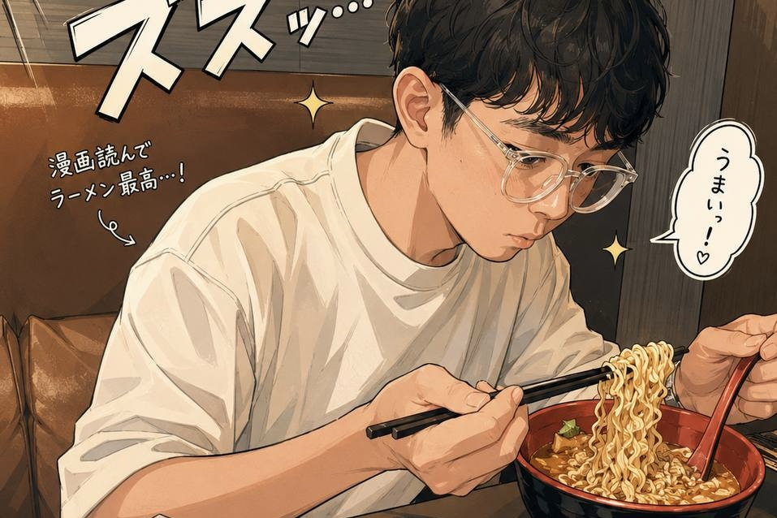

昨天開始，家裡莫名其妙電壓不穩。一開始還有點像笑話，家裡的電扇變成自然風，風的大小完全隨機；燈泡變成呼吸燈，亮暗完全看他心情。聽起來很幽默，但我人在現場也是只能苦笑了。因為電壓不穩，所有的電器會不定期重新開關機，白天還沒有什麼感覺，到了晚上，不規則的燈光跟忽大忽小的風，家裡整個恐怖感直線上升。不過晚上反正都在睡覺也就算了，還可以忍一下。但是到了白天，情況越來越糟糕，幾乎接近停電了。我人生有意識以來，斷網、斷水都遇過，勉強都還可以撐過去，斷電這個真的完全不行，沒有冷氣，沒有電扇，室內35度，直接把我逼出家門。

本來想背著電腦去圖書館看書的，結果偏偏遇到端午節，全部圖書館都休假。接著想到摩斯漢堡，結果我家附近的摩斯把全部的插座都封起來了。這時候我已經熱到不行了，跑了幾間咖啡店，不是客滿，就是沒可以充電的位子。最後實在沒辦法了，突然想起了以前公司旁邊的E書漫，打電話去問發現除了可以充電，還可以看漫畫，簡直就是肥宅天堂，於是我馬上就衝過去。

到了E書漫後，發現就是是以前漫畫店加上網咖的進化版，除了可以充電、看漫畫、用電腦以外，還可以洗澡、喝飲料、吃飯，直接嚇到我了。想不到漫畫店竟然進化成這麼酷的地方，環境也蠻乾淨的。其實我小時候蠻喜歡去漫畫店的，從地方的漫畫店到十大、花蝶、錦城、皇冠、白鹿洞等等，但不知道什麼時候開始，可能是娛樂習慣改變，也可能網路的盜版漫畫太多，漫畫店漸漸的沒落了。現在要找一個正經的漫畫店在裡面坐著看漫畫，還真的不好找。

我本來還帶了電腦，想說可以來玩一下單機遊戲打發時間。結果看到一大堆的漫畫，完全對電腦沒有興趣了。那個小時候逛漫畫店的感覺，一下子全部都湧上來了。我到處晃，看到了很多以前的漫畫，什麼《鐵拳對鋼拳》、《烙印勇士》、《無間雙龍》、《怪物》之類的。光是要選哪一套來看，我就花了快一小時。我的手機放在座位上充電，我還沒開始看漫畫就已經充滿電了。因為時間有限，只能挑一套集數沒那麼多的漫畫來看，最後拿了《PLUTO 冥王》來看。就這樣看了三個小時，然後就拍拍屁股回家。當然，走之前沒忘了點一碗台灣網咖最經典的泡麵。

其實E書漫裡面的漫畫跟雜誌不太多，如果是比我資深的肥宅，可能裡面架上的漫畫全部都看過了。裡面也有電腦可以用，不過我畢竟不是去打電動的，所以我也不知道這裡的電腦好不好，只能說有機會再來試試了。

不過重點其實不是設備好不好，或是漫畫多齊全。這邊給我的是一種感覺，或是一段回憶。大口喝飲料，低頭看漫畫，周圍有很多人，但大家都很安靜。我不知道大家有沒有一群人在漫畫店看漫畫的經驗：明明彼此都不認識，也沒有說話，可是呼吸、翻頁、喝飲料的節奏，好像會在某個瞬間莫名同步。如同《強風吹拂》王子他的看漫畫理論，一起看漫畫的時候，周圍的人會莫名的同步。當然現實沒有動漫那麼誇張，但我大概懂那個感覺。

總之，這次家裡電壓不穩其實把我搞得很慘，上面講的好像很輕飄飄，但實際上完全不是。因為電壓不穩，導致我最貴的電風扇直接燒掉，還有吹風機也壞了，升降桌的控制器也燒掉了，莫名其妙噴了一堆錢，還要躲回爸媽家才有地方洗澡睡覺。所以這不是什麼酷酷的回憶小旅行，就是一個很熱很煩很貴的突發事件。

只是沒想到，在這種亂七八糟的情況下，我竟然久違的坐進漫畫店，看了幾小時的漫畫，還吃了一碗泡麵。這其實沒有什麼人生的啟發，只是莫名的回味了一把青春，雖然有點貴，但感覺還不錯，沖淡了一點倒霉的感覺。不過隔天回家後發現排水孔堵住，那又是另一個故事了。

