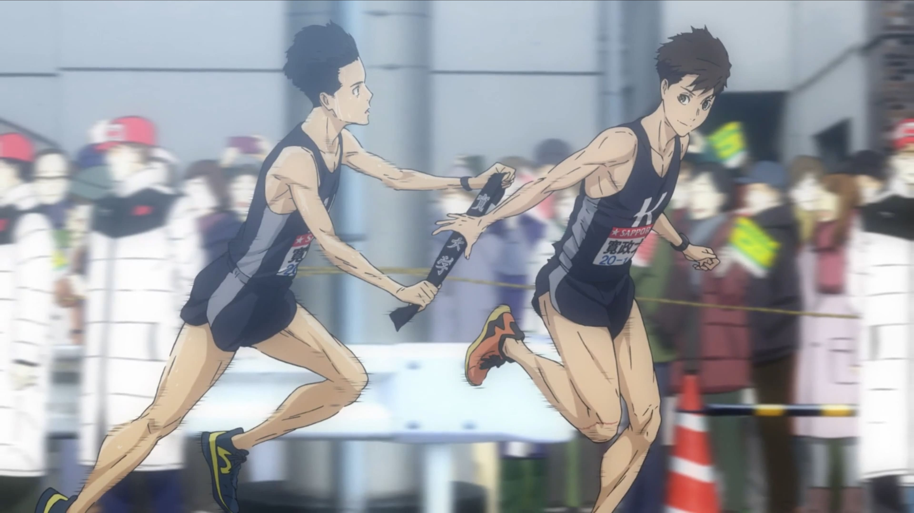
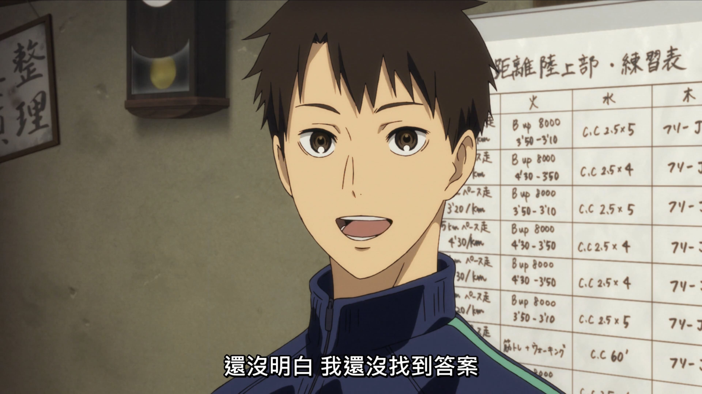

***說的是跑步，談的其實是人生。***

## 簡介

從現實的角度來看，「強風吹拂」的劇情並不合理，一群外行人是不可能在短時間的訓練後，就去參加箱根驛傳的。如果把它當作一個寫實的作品，反而會錯過重點，他的重點就是在探討「為什麼要做這件事」。10個性格鮮明的角色，在跑步這件事上各自掙扎、彼此拉扯。不能說每一段都能產生共鳴，但那些努力本身，就足以讓人感動的亂七八糟。

明明就是一個運動番，然後也一直在畫跑步的動作，關於跑步的細節卻說的很少，甚至都沒有競技的描述，根本沒有熱血的對決。另一個相反的例子就是「飆速宅男」，那種比較以競技為核心的描述。但是兩者看起來都一樣讓人熱血沸騰，我覺得這就是「強風吹拂」厲害的地方。不是在比較誰才是贏家，對競技運動除了勝敗以外，討論是否還有沒有別的意義。再延伸的話，人生除了追求財富與地位之外，還有沒有別的事情要做？

整部片的主題都是在尋求跑步的意義：為什麼要跑步？跑不贏的話為什麼要跑？何謂強大？雖然在最後，每個人似乎都找到了各自跑步的理由，但那是一個非常個人的解答，而不是一個可以放著四海皆準的答案，自己跑步的理由還是需要自己去找出來。這其實可以類比到很多領域，下班之後的看書、騎車、創作等等，如果不是為了比賽，或是比賽也贏不了，那麼做這些事還有意義嗎？這些答案可能有一千萬種可能，而這些答案也只有一直堅持在裡面的人才能回答出來。

## 心得

可能我的生活的足夠久了吧，也有可能是太會穿鑿附會，裡面有些段落都可以找到類似的人生來回味。這邊很直接想起的一個故事，就是當初魔獸世界的10人祖阿曼，我們也只是堪堪組成10人去挑戰，我們沒有大公會的資源，然後團隊的人也幾乎都是菜雞，還湊不出所謂的最佳陣容，但我們還是伺服器前幾個通關的團隊。當時雖然只有10個人，也因為沒那麼多選擇，反而事情變得更單純了。回過頭來看，這種沒有最佳條件，卻還是往前走的狀態，跟劇中的描述蠻相似的。

還是要講一下表現的部分，前面的作畫風格非常穩定，但最後幾集不知道是太趕還是經費不夠，畫風有點崩掉。印象很深的是神童跑步的時候，我都不確定到底是錢不夠用了，還是想用崩掉的畫風呈現神童快累死的感覺。音樂的話從頭到尾都超棒的，我不是很喜歡弦樂的人，但片中很多短的插入曲，真的會讓人突然雞皮疙瘩，最推薦的還是ED1吧，搭配前半段劇情的迷惘，實在太美了。

## 小結

最後附上整部片我最喜歡的片段，是神童在做網站說的一段話：

「紙上談兵誰都會」

「我不喜歡這樣 大家也一樣吧」

「說要做就會去做」

「我一點都不強大」

「只是無論怎樣 都只管埋頭去做」

在這個嘴巴比行動快的時代，我很喜歡這種認真的人。 我一直覺得，行動本身也是意義產生的過程，而真正能被相信的，從來不是說出來的話，而是做出來的事。

