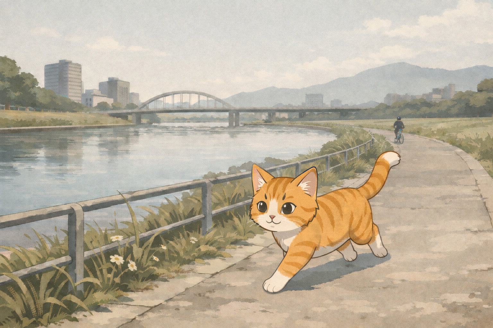

## 跑步緣起

前一陣子離職之後，被我妹抓去美國當狗保母。整天在家遊手好閒的，她丟下一句：「不然你去跑步看看。」
於是我們就去買鞋。

這次沒有看 YouTube 評測亂買，而是老老實實在店裡一雙一雙試，聽店員的介紹，在跑步機上實際跑，找到一雙真正適合我大腳的鞋子。
穿上去開始跑的那一刻，才知道舒服的鞋子原來差這麼多。

從那天開始，我每週跑三四次，跑了三個多月。

## 沒有受傷的原因

以前跑步常常伴隨一些小傷痛，然後最後放棄，這次卻幾乎沒有。

主要的原因就是：

- 換了一雙適合的鞋子
- 刻意放慢的速度

Zone2 的訓練其實講了很多年了，但是實際跑的時候還是會想偷偷的加速，讓總結的畫面好看一點。7分速總是比8、9分速體面。

但這次沒有。

我刻意慢到一個完全不喘的速度。用我妹的說法就是：「想像一個老太太在你旁邊跑步，你要跟她一樣慢，還要能跟她講話。」
結果就是——我跑的更久更遠了。

## 心態的改變

不過我個人覺得這次真正不同的地方，不是鞋子也不是速度，而是心態上的轉變。

舉例來說：

今天下午，我沒事做的時候，腦中浮現的第一個念頭竟然不是打電動或是看書，而是：

「沒事做，跑個步吧。」

這對於以前的我是難以想像的一件事，因為跑步通常會帶有一點目的性：減肥、鍛鍊心肺、彰顯自律、打卡等等。

這次卻是為了跑步本身而出門，而且還沒有帶上什麼目的性。我覺得這就是這次跟之前完全不一樣的地方。

沒有要做什麼，就是穿上鞋，出門，跑步。中間就是放空、想事情、甚至跟自己吵架都可以

看到酷酷的東西就停下來拍照，心跳飄了就走幾步，以前還要停錶什麼的，現在全部隨它去了。
就跟打電動一樣，想怎麼玩就怎麼玩，沒有人在比什麼 speed run 或是最強配裝什麼的。

然後發現，這樣的跑步，還挺有趣的。

## 結論

回頭想想，雖然跑三個月也不算很多，但對我個人來說，能堅持這麼久不受傷，我覺得不只是鞋子或是配速的問題，還包括了心態上的改變。

在各個不同的地方跑步，享受跑步帶來的感覺，本身就是一件很有意思的事情。

如果要總結最近跑步的心得，大概就是：

當跑步成為目的的時候，很多東西就不需要那麼在意了。

最後還是要補充一下，以上都是我個人的經驗。

我目前慢慢跑、穿對鞋子、心態平和似乎就比較不會受傷，不過也還沒有經過長時間的驗證，所以如果照抄遇到問題的話，還是去諮詢一下專業人士比較安全。
