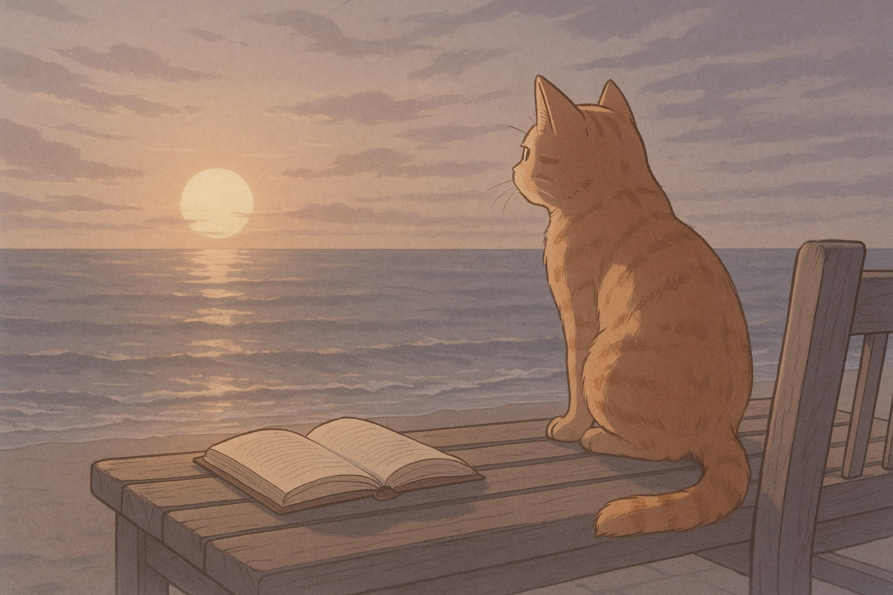

## 前言

前一陣子莫名陷入一種倦怠感，上班覺得疲倦，下班沒有目標。
發呆了幾天後，忽然想到老妹，她常看一些我沒接觸過的書，或許能幫我轉換心情。

於是就請她推薦她的書單，然後她就推薦給我這本她很喜歡的書：長日將盡。

## 簡介

整本書講述的是一個老管家，放假出門，旅途遇見一些其他人，勾起一些回憶，再來見到了舊同事，最後在海邊自省。

最後見到舊同事與海邊自省，雖然只有短短的篇幅，但因為前面的鋪陳充足，反而讀起來格外的深刻。

不想劇透，加上網路上已有許多精采的介紹，所以這邊就簡單帶過。

## 心得

剛開始看的時候有點悶。整體的氣氛壓抑，敘事也很平淡。主角一下進入回憶，一下回到現實，節奏有點不太習慣，加上對管家很難有同理心，一開始覺得是個工作狂，中間覺得是個怪人。抱持著看好戲的心態看下去，看看作者還能怎麼寫。

但是從中間開始後，漸漸發現作者想要表達的意思，我開始看一段想一段，開始想：他是不是在說我？

看到了最後才發現，原來我跟這個管家並沒有什麼差別。

從開始到結束，看書的體悟總結起來就是：**初聽不知曲中意 再聽已是曲中人**

這本書給我的衝擊蠻大的，心中的五味雜陳很難表達出來。

管家的固執跟曾經的我有那麼一點相似

- 只要努力總有一天會被看到。
- 忍耐是一種成熟的表現。
- 許多選擇與錯過，是否只是因為不願放下那份自以為重要的尊嚴與責任。

我看完後在椅子上發呆了很久，心情難以平復。

---

其實很多東西在心中隱隱約約都有一些答案，但是很少被這樣直接的戳破。

其中有兩幕讓我印象深刻的場景：

第一個是，當管家父親過世時，剛好家裡在忙，他中間去探望父親的時候，他們的對話也只有工作，甚至沒辦法陪伴到最後一刻。

第二個是，當女管家接受求婚時，他只是淡淡的恭喜對方，然後藉口還有更重要的事情：他的主人正在談論一個關於世界的重要事件，他必須隨時待命。

尤其第二段的時候，管家應該是十分震驚，但是他仍然堅持他心目中「尊嚴」的形象，這邊看得出來其實他很動搖，他甚至很明確的知道女管家在門的背後哭泣。

這邊我完全看不懂他到底在壓抑什麼，然後只為了當一個有「尊嚴」的管家。結果是什麼？ 酒一拿進去就被請到外面，然後在樓下待命了一整晚。

看似荒謬，其實與現代很多人無異，包括我自己。
不知道為了什麼而壓抑自己。

## 結論

蠻推薦這本書的，有時候會覺得在特定的時間剛好看到適合的書，那種心靈的共鳴格外清晰。

「人生只有一次」，這句話其實很多地方都會提到。有些人小時候就領悟了，有些人可能要跟管家一樣老了才理解，有些人以為自己懂了其實並不懂。 

即便懂了，要馬上改變其實也是很困難，因為衝擊的是過往人生累積的習慣、價值觀。

或許有一天，我能再回頭補完這篇心得，把那份衝擊的感覺被說得更清楚。
