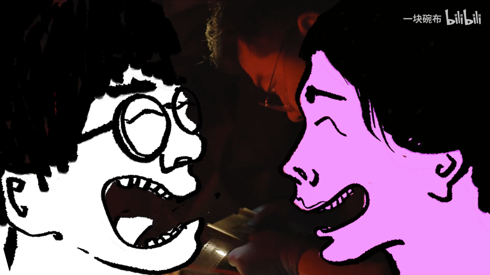
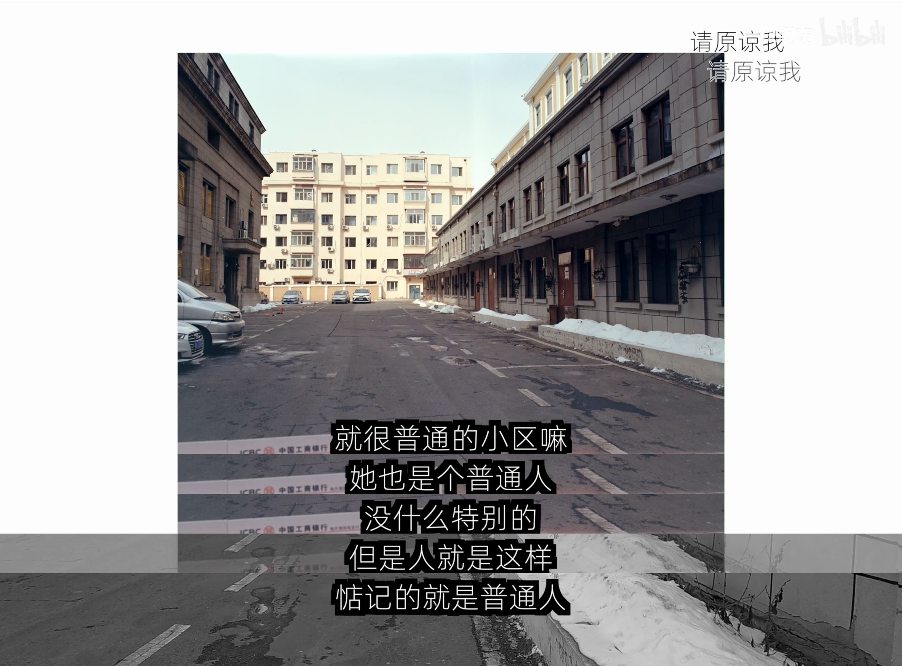
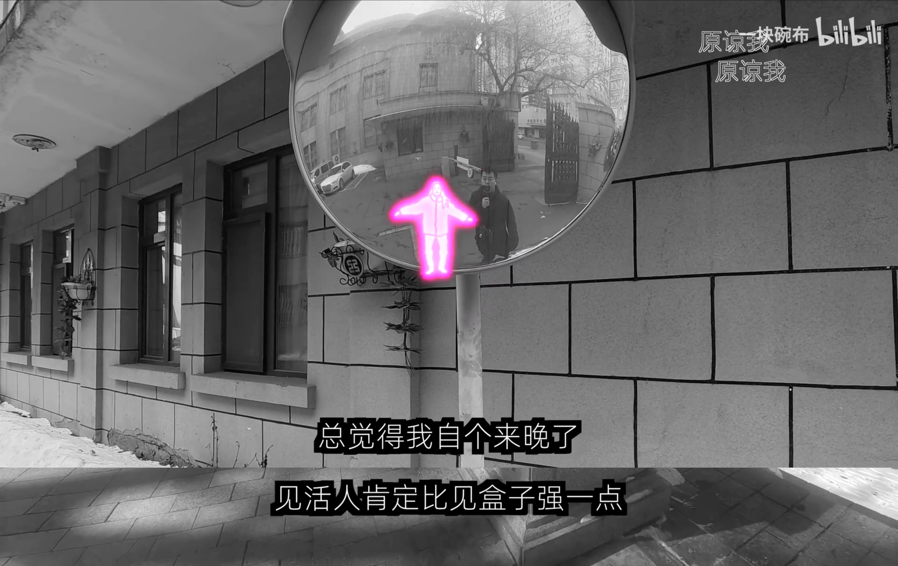

如果問最近在忙什麼，大概就是等上班，寫讀書心得，看電工小謝吧。這是我近期看過最好看的影片，我應該看了超過20次了，很難相信會有一個影片短時間讓我看那麼多次。

劇情大意是農村青年一邊照顧生病的父親，一邊談了一場沒有結果的網戀。前半段還蠻好笑的，角色的畫風我很喜歡，然後後面急轉直下，配上《請原諒我》真的是有夠催淚的。拍攝手法我不懂，但是整個影片看起來很有質感。

其實這種小人物的故事無論在什麼時候都挺感動人的，我們在現實中很喜歡幫別人貼標籤：xxx 就是這樣、臭 xxx 之類的。但其實每個人也都是人生父母養的，每個人都有一段外人看不見的掙扎，如果仔細去觀察每一個人，都會有一個精彩的故事。

回到這部影片，我會一直重複看，除了影片拍的好，音樂選的也很棒以外，題材也選的很好。一個千里之外跟我們沒什麼關係的普通人，做了跟我們差不多的人生選擇，這種因逃跑產生遺憾的情節，在人生的路上實在太多了，看的時候特別有感觸。

**人生是不可能一直有勇氣去直面所有的事情，不可能的。**

但問題與痛苦就是那樣，總是逃不掉的，如同小謝的爸爸一樣，講得再怎麼灑脫，也是自己承受自己的後果。其實理智上會知道所有的選擇可能都是當時最好的選擇，然後人生其實沒有那麼多決定性的瞬間，但這種慢慢堆積，然後最後發現路彎掉的時候，超難過的。原本都會以為可以有下次機會，但最終發現上次就是此生僅有的機會的時候，真的超難過的。

對我個人來說，如果沒有達到自己心裡的目標，就有點像是一種逃跑。不一定是達成某件事情，而是那個過程有沒有足夠問心無愧，很遺憾的是，這種事情還蠻多的。事情過了之後，又會用很多大道理蓋過去，試圖告訴自己當時並沒有錯。最終又會發現，原來人生沒有那麼多大道理需要思考的，說到底都是當下的選擇而已，問心無愧一點，直面問題，即便結果並不完美，事後回顧也不會那麼遺憾。

裡面最難過的段落，大概是小謝用那個淡定的口氣說： 

「我總覺得我自個兒來晚了」

「見活人總比見個盒子強」

那種冷靜地回頭看，帶著一點後悔和遺憾的語氣，反而更讓人難受。

最後附上連結

[一个县城青年，逃跑的十年](https://www.bilibili.com/video/BV1mVSUBrEz5/?share_source=copy_web&vd_source=557300c661d55dd383d099134de66576)